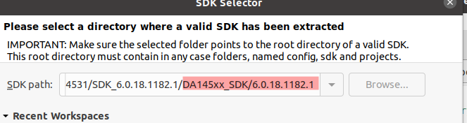
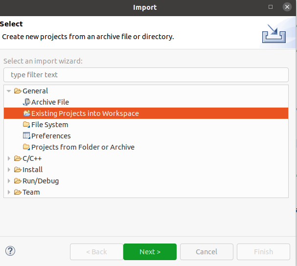
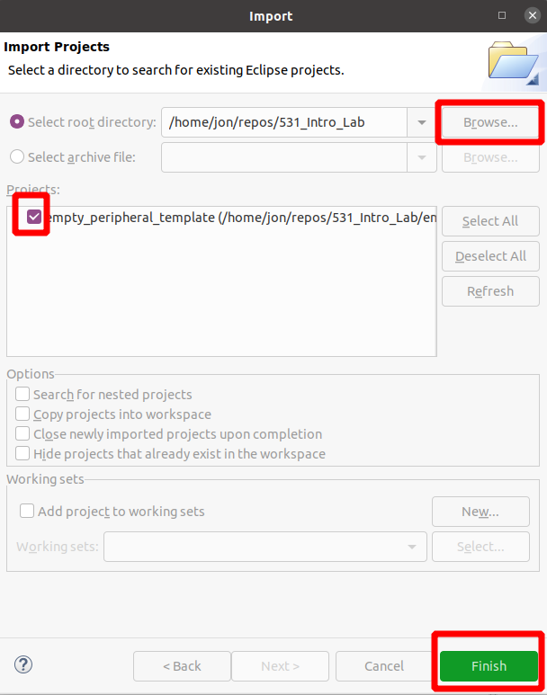
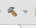

# 531_Intro_Lab
Taking the DA1453x out of the box, changing sleep, advertising, and adding timers and debug statements.  This training is connected with toolbox and illustrates basic getting started ideas.

## Prerequisites

 - SmartSnippets Studio should be installed.
 - SmartSnippets Toolbox should be installed.
 - TeraTerm or equivalent terminal program should installed.
 - SDK6 is downloaded and extracted to your computer.
 - Lab uses DA14531MOD Pro DK.

 ## Building the Project the First Time

 1. Open SmartSnippets Studio, and select a workspace.  The workspace should be the top level of SDK6: 

 2. Clone this repo, or download the source from main.

 3. From SmartSnippets Studio, Go to File->Import.  Select Existing Projects into Workspace:  and press Next.

 4. Click the browse button on the right, then navigate to this repo's code location.  Check the empty_peripheral_template project and select finish.   

 5. Next, click the pull down arrow on the Build icon and select the DA14531. 

 6.  Your project should compile and be ready to load.

