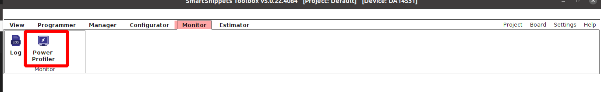
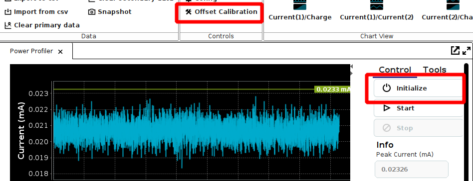
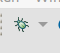
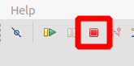
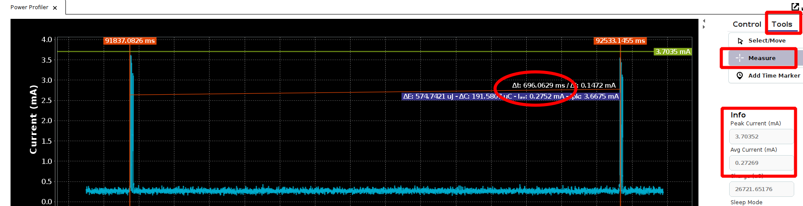
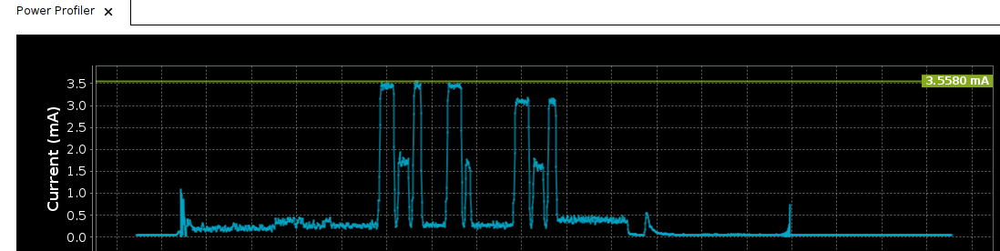

# 531_Intro_Lab
Taking the DA1453x out of the box, changing sleep, advertising, and adding timers and debug statements.  This training is connected with toolbox and illustrates basic getting started ideas.

## Prerequisites

 - SmartSnippets Studio should be installed.
 - SmartSnippets Toolbox should be installed.
 - TeraTerm or equivalent terminal program should installed.
 - SDK6 is downloaded and extracted to your computer.
 - Lab uses DA14531MOD Pro DK.

 ## Prepare Hardware and Calibrate Power Profiler

 1. Remove Flash Jumpers (Module has integrated flash) - On J1 Remove the first 5 jumpers.

 2. Remove Daughterboard, and connect Motherboard to your computer

 3. Got to Board->Device and select the DA14531

 4. Create a new project and name it 531_Mod_Lab.  

 5. Next, select Board and Check the box next to Power Profiler

 6.  Navigate to Power Profiler Icon and select this tool.   

 7.  With the board removed, press Initialize then offset calibration. 

 8.  Your power profiler is calibrated, you can plug the board back in now.

 ## Importing the Project for the First Time

 1. Open SmartSnippets Studio, and select a workspace.  The workspace should be the top level of SDK6: 

 2. Clone this repo, or download the source from main.

 3. From SmartSnippets Studio, Go to File->Import.  Select Existing Projects into Workspace:  and press Next.

 4. Click the browse button on the right, then navigate to this repo's code location.  Check the empty_peripheral_template project and select finish.   

 5.  Your project should compile and be ready to load.

 ## Lab

 1. Navigate to user_config.h, under user_config folder, and open the file.  

 2.  Navigate to line 183, and change USER_DEVICE_NAME to something unique.  Keep the name under 28 bytes to be sure it fits in an advertising packet.  

 3.  Click the build icon pull-down, and click DA14531 (not DA14531-01). 

 4. Now click the debug symbol, and select RAM_DA14531. 

 5.  A dialog box 'Confirm Perspective Switch' will pop-up.  Select Switch.

 6.  We COULD hit the RUN button, but this keeps JTAG attached.  If we select stop, the RAM code will continue to run with the JTAG de-tached, so we can see accurate power numbers.  Select Stop .

 7.  Open up your Renesas SmartBond App and select Scan.  You should see your device, with it's unique name advertising. 

 8.  Next, open the Power Profiler. And select 'Start'.  You should see the power profiler capturing advertising events.  

 9.  After capturing a few seconds of data, we can press 'Stop'.  On the right, we can see Peak Current, average current, etc.  We can also click on Tools and start to measure events.  Use Mouse Wheel Up or '+" to zoom in to two advertising events.  Then select 'Measure'.  We can use our left mouse to place the first cursor and then set the second cursor.  We can see the advertising interval from the measurement.  .

 10.  Go back to Smart Snippets Studio, and navigate to user_config.h again. On line 77, change app_default_sleep_mode to ARCH_EXT_SLEEP_ON.  Also, let's change line 91 and 93, intv_min and intv_max to a different interval (between 100ms and 10.24 seconds).

 11.  Build the code, and deploy via JTAG as in steps 4-6.  Once deployed, start the power profiler again, and let it run.  Note that sleep is now enabled, and measure to verify your updated advertising intervals. We can also zoom in and examine a single advertising event.  

 12. The SDK also implements a timer functionality that handles sleep modes, waking up and going back to sleep.  Let's add a timer.  Navigate to user_app/user_empty_peripheral_template.c.  At the top of the file include the timer module:

 ```c
#include "app_easy_timer.h"
 ```
 13. Set a timer interval at the top of the file:
 ```c
 #define TIMER_INTVL            (25)
 ```
 Go to the function user_app_on_set_dev_config_complete and initialize and start the timer.  

 ```c
app_easy_timer(TIMER_INTVL, user_timer_cb);
 ```
 14. Add a timer callback above user_on_connection(..), and reload the timer here.  

 ```c
 static void user_timer_cb(void)
{
        app_easy_timer(TIMER_INTVL, user_timer_cb);  
}
 ```

 15.  Build your code, deploy again. And use the Power Profiler to pick up timer events.  Note:  The first argument for the timer interval is in intervals of 10milliseconds. 

 16.  The SDK also handles uart debugging statements.  It utilizes a queue, and also handles keeping the device awake while printing and releasing to sleep when done.  Let's enable this feature.

 17. Navigate to user_config/da1458x_config_basic.h.  On line 163 change the #undef to:

 ```c
 #define CFG_PRINTF
 ```

 18. In user_empty_peripheral_template.c, in user_app, add the include for the console module:

 ```c
 #include "arch_console.h"
 ```
 19. Add a static counter variable at the top of the file:

 ```c
static uint32_t timer_count __SECTION_ZERO("retention_mem_area0");
 ```

 20. Initialize the variable to zero in user_app_on_set_dev_config_complete.  Not necessary becase it's zero initialized, but good practice.

 21. In the user_timer_cb increment the counter, and calculate the current time:

 ```c
 uint32_t current_time_ms;
 timer_count++;
        
 current_time_ms = timer_count*TIMER_INTVL*10;
 ```

 22.  Let's print the current time now in the user_timer_cb (Happens in kernel context not interrupt context so okay to do here):
 ```c
 arch_printf("%s: %d\r\n", __func__, current_time_ms);
 ```

 23.  Build and deploy as in previous steps.

 24.  Open up TeraTerm or another terminal window, at 115200 Baud, 8, N,1 -  and you should see the following printout, on every timer interrupt.

 ```bash
 user_timer_cb: 97250
 ```

 25.  On the power profiler, you should see the timer event extended.


